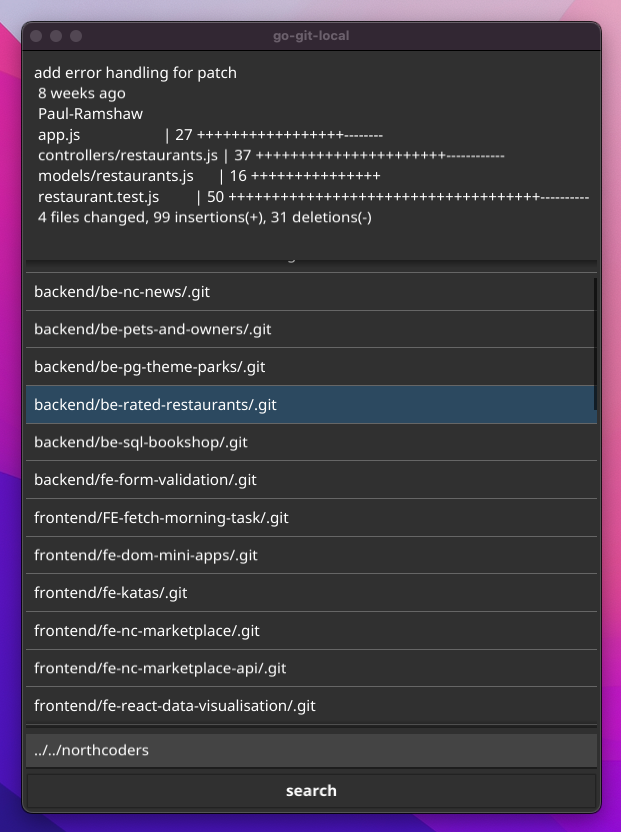

# go-git-local

go-git-local provides a GUI for viewing local git projects. It currently allows you to search a directory for git projects and then view a summary of the last commit for that project. It's written in Go and uses the Fyne GUI toolkit.



## Getting started

To test out this application on your local machine, you'll need [Git](https://git-scm.com/) and [Go](https://go.dev/doc/install) installed. Then take the following steps:

1. Clone the repository to your local machine

```
$ git clone https://github.com/Paul-Ramshaw/go-git-local.git
```

2. Go into the repository

```
$ cd go-git-local
```

3. Start the application

```
$ go run main.go
```

## Usage

By default go-git-local will search its parent directory for git projects. To search a different folder provide a relative path in the search input and click "search". If any git projects are found, they'll be displayed in a list. Select a project from the list to view a summary of the last commit for that project.
